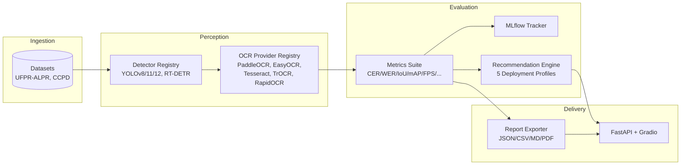

# OCRBench

> A modular benchmarking platform for **Automatic License Plate Recognition (ALPR)** — evaluate, compare, and recommend OCR and detection pipelines across accuracy, speed, and cost at scale.

[](https://opensource.org/licenses/MIT)
[](https://www.python.org/)
[](https://pytorch.org/)

---

## Overview

**OCRBench** is an open-source framework for rigorously benchmarking optical character recognition (OCR) and object detection models in the context of license plate recognition. It provides a single, extensible interface to run dozens of model combinations against standard datasets, compute a comprehensive set of accuracy and efficiency metrics, track experiments, and produce deployment recommendations.

The project was built to demonstrate a production-grade **perception pipeline** — detection → cropping → recognition → evaluation — and the engineering practices (modular design, typed interfaces, experiment tracking, containerized deployment, and a service layer) that make such a system maintainable and reproducible.

> *Relevant to Autonomous Systems / Perception roles:* OCRBench models the same sense–understand–evaluate loop used in real perception stacks (object detection + scene text recognition), and exposes it through both batch evaluation and live service interfaces.

---

## Features

- **Multi-model benchmarking** — run 5 OCR engines and 4 detectors against the same dataset with one call.
- **Pluggable architecture** — add a new provider or detector by implementing one abstract interface and registering it; no changes to the orchestration layer.
- **Comprehensive metrics** — accuracy (CER, WER, exact-match, character accuracy, precision/recall/F1), detection (IoU, mAP), and efficiency (FPS, latency p95, memory, cost-per-image).
- **Experiment tracking** — every run is logged to MLflow with parameters, metrics, and artifacts for reproducible comparison.
- **Deployment recommendation engine** — rank pipelines against 5 operational profiles (Real-Time, High-Accuracy, Low-Cost, Edge, Balanced).
- **Multi-format reporting** — export results to JSON, CSV, Markdown, and PDF.
- **Trainable components** — fine-tune TrOCR (scene-text recognition) and YOLO/RT-DETR detectors on custom data.
- **Two delivery surfaces** — a Gradio web UI and a FastAPI REST service, both containerized via Docker Compose.

---

## Architecture

OCRBench is organized around a **provider-agnostic core** and a **benchmark orchestrator** that wires datasets, models, metrics, tracking, and reporting together.



### Core concepts

| Module | Responsibility |
| --- | --- |
| `core` | Abstract interfaces (`BaseOCRProvider`, `BaseDetector`) and shared datatypes (`OCRResult`, `DetectionResult`, `BenchmarkResult`). The contract that every model integration implements. |
| `datasets` | Dataset loaders and a registry (`ufpr-alpr`, `ccpd`) exposing images + ground-truth labels. |
| `providers` / `detectors` | Model implementations behind a common interface, resolved by a name → class registry (factory pattern). |
| `benchmark` | `BenchmarkRunner` orchestrates the full evaluate-and-measure loop and normalizes results across providers. |
| `metrics` | Pure, batch-oriented metric functions for accuracy, detection quality, and runtime performance. |
| `experiments` | `MLflowTracker` wrapper for parameter/metric/logging of every run. |
| `recommendation` | Weighted, profile-based ranking of pipelines for a target deployment scenario. |
| `reports` | Multi-format exporters for human- and machine-readable results. |
| `training` | Fine-tuning entry points for TrOCR and YOLO/RT-DETR. |
| `apps` | `FastAPI` REST API and `Gradio` UI on top of the core library. |

### Design highlights

- **Interface segregation** — OCR and detection are decoupled behind `BaseOCRProvider` / `BaseDetector` (`ocrbench/core/interfaces.py`), so adding a model is additive.
- **Registry / factory pattern** — `get_ocr_provider()`, `get_detector()`, `get_dataset()` resolve implementations by string key, keeping the orchestrator unaware of concrete classes.
- **Normalized results** — every provider returns a common `OCRResult`, so metrics and reporting are provider-independent.
- **Configurable** — Hydra/OmegaConf-driven configuration (`ocrbench/configs/config.yaml`).

---

## Tech Stack

| Layer | Technologies |
| --- | --- |
| Language | Python 3.9+ |
| Deep Learning | PyTorch, Transformers (TrOCR), Ultralytics (YOLO/RT-DETR) |
| OCR Engines | PaddleOCR, EasyOCR, Tesseract, TrOCR, RapidOCR |
| API & UI | FastAPI, Uvicorn, Gradio, Pydantic |
| Experiment Tracking | MLflow |
| Reporting | Pandas, Matplotlib, ReportLab |
| Config | Hydra-Core, OmegaConf, PyYAML |
| Packaging & Infra | setuptools, Docker, Docker Compose |

---

## Supported Models, Datasets & Metrics

**OCR providers (5):** PaddleOCR · EasyOCR · Tesseract · TrOCR · RapidOCR

**Detectors (4):** YOLOv8s · YOLOv11s · YOLOv12s · RT-DETR

**Datasets (2):** UFPR-ALPR · CCPD

**Metrics:**
- *Accuracy:* Character Error Rate (CER), Word Error Rate (WER), Exact Match, Character Accuracy, Precision / Recall / F1
- *Detection:* IoU, mAP
- *Efficiency:* FPS, Latency (p95), Peak Memory, Cost-per-image

**Deployment profiles (5):** Real-Time · High-Accuracy · Low-Cost · Edge · Balanced

---

## Getting Started

### Prerequisites

- Python 3.9 or newer
- (Optional) NVIDIA GPU with CUDA for training and accelerated inference
- Docker & Docker Compose for the containerized deployment

### Option A — Docker Compose (recommended)

```bash
git clone https://github.com/prathode/ocr-bench.git
cd ocr-bench
docker compose up
```

- Gradio UI: http://localhost:7860
- REST API: http://localhost:8000 (docs at `/docs`)

### Option B — Local installation

```bash
git clone https://github.com/prathode/ocr-bench.git
cd ocr-bench
python -m venv .venv && source .venv/bin/activate
pip install -e ".[dev]"
```

---

## Usage

### 1. Python API

```python
from ocrbench.benchmark import run_benchmark

results = run_benchmark(
    providers=["paddleocr", "trocr", "easyocr"],
    dataset="ufpr-alpr",
    mode="ocr-only",
    batch_size=8,
)
```

### 2. Command-Line Interface

```bash
# Benchmark a set of providers
python -m scripts.ocrbench_cli benchmark \
    --providers paddleocr trocr easyocr \
    --dataset ufpr-alpr \
    --batch-size 8

# Fine-tune a detector (YOLO)
python -m scripts.ocrbench_cli train \
    --mode detector --model yolov8s \
    --dataset ufpr-alpr --epochs 20 --lr 1e-4
```

### 3. REST API

```bash
curl -X POST http://localhost:8000/benchmark \
  -H "Content-Type: application/json" \
  -d '{"providers": ["paddleocr", "trocr"], "dataset": "ufpr-alpr"}'
```

Endpoints: `GET /providers`, `POST /benchmark`, `POST /train`, `GET /health`.

### 4. Gradio UI

Launch the interactive dashboard (benchmark, training, and recommendations tabs):

```bash
python -m apps.gradio.app
```

### Deployment recommendations

```python
from ocrbench.recommendation import RecommendationEngine

engine = RecommendationEngine()
top = engine.get_recommendations(results, profile_name="edge", top_k=3)
```

---

## Training

| Mode | Models | Notes |
| --- | --- | --- |
| `ocr` | TrOCR (`microsoft/trocr-base-printed`) | Vision-encoder–decoder fine-tuning with AdamW |
| `detector` | YOLOv8s / YOLOv11s / YOLOv12s / RT-DETR | Ultralytics training loop, auto dataset YAML |

```python
from ocrbench.training import run_training

run_training(mode="detector", model_name="yolov8s",
             dataset="ufpr-alpr", epochs=20, batch_size=16, learning_rate=1e-4)
```

All training runs are tracked in MLflow for reproducibility.

---

## Project Structure

```
ocr-bench/
├── ocrbench/                 # Core library
│   ├── core/                # Interfaces & datatypes
│   ├── datasets/            # Dataset loaders + registry
│   ├── providers/           # OCR engine implementations
│   ├── detectors/           # Detection model implementations
│   ├── benchmark/           # Orchestration pipeline
│   ├── metrics/             # Accuracy / detection / efficiency metrics
│   ├── experiments/         # MLflow tracking
│   ├── recommendation/      # Profile-based ranking engine
│   ├── reports/             # JSON / CSV / Markdown / PDF exporters
│   ├── training/            # TrOCR & YOLO fine-tuning
│   └── configs/             # Hydra/OmegaConf config
├── apps/
│   ├── api/                 # FastAPI service
│   └── gradio/              # Web UI
├── scripts/                 # CLI & utility scripts
├── tests/                   # Unit tests
├── docker/                  # Dockerfile & Compose
└── pyproject.toml
```

---

## Roadmap

- [ ] Native image preprocessing (de-skew, super-resolution) stage
- [ ] Video / stream benchmarking for real-time pipelines
- [ ] Comparative leaderboard UI backed by MLflow
- [ ] Additional datasets (e.g., OpenALPR, custom captured feeds)
- [ ] Quantization / ONNX export benchmarks for edge profiles

---

## Contributing

Contributions are welcome. To add a new model:

1. Implement `BaseOCRProvider` or `BaseDetector` from `ocrbench/core/interfaces.py`.
2. Register it in the corresponding registry.
3. Add unit tests under `tests/`.
4. Open a pull request describing the model and benchmark results.

Please run `ruff`, `black`, `isort`, `mypy`, and `pytest` before submitting.

---

## License

Released under the [MIT License](LICENSE).
